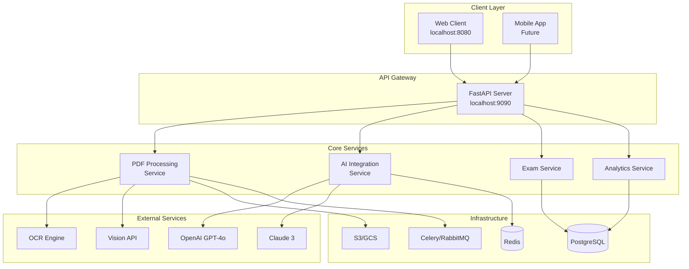
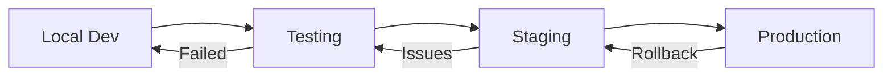

# Product Requirements Document (PRD)
# 학점마스터 Backend API Service

**Version**: 2.0.0
**Date**: 2024-11-10
**Status**: Final
**Owner**: Backend Development Team

---

## Executive Summary

학점마스터(Grade Masters)는 대학생의 효율적인 시험 준비를 지원하는 AI 기반 학습 플랫폼의 백엔드 API 서비스입니다. PDF 학습 자료를 입력받아 OCR 및 이미지 분석을 통해 내용을 완벽하게 추출하고, AI를 활용하여 요약, 문제 생성, 채점, 학습 분석 기능을 제공합니다.

### Key Features
- 🔍 **Advanced PDF Processing**: OCR 및 이미지/그래프 분석 지원
- 🤖 **Dual AI Integration**: OpenAI GPT-4o & Anthropic Claude 3
- 📊 **Comprehensive Analytics**: 학습 패턴 분석 및 맞춤형 추천
- ⚡ **High Performance**: 비동기 처리 및 캐싱 최적화
- 🔒 **Enterprise Security**: JWT 인증 및 데이터 암호화

---

## 1. Product Vision & Strategy

### 1.1 Vision Statement
> "AI 기술을 활용하여 학습 효율을 극대화하고, 개인화된 학습 경험을 제공하는 차세대 교육 플랫폼의 핵심 엔진"

### 1.2 Strategic Goals
1. **학습 효율 향상**: PDF 자료의 핵심 내용을 5분 내 파악
2. **시험 대비 최적화**: 실제 시험과 유사한 문제 자동 생성
3. **개인화 학습**: 취약점 분석 및 맞춤형 학습 경로 제공
4. **확장 가능한 아키텍처**: 다양한 문서 형식 및 AI 모델 지원

### 1.3 Success Metrics
| Metric | Target | Priority |
|--------|--------|----------|
| API Uptime | 99.9% | P0 |
| Average Response Time | < 2s | P0 |
| PDF Processing Success Rate | > 95% | P0 |
| OCR Accuracy | > 90% | P1 |
| User Satisfaction (NPS) | > 40 | P1 |
| Daily Active Users | > 1,000 | P2 |

---

## 2. Technical Architecture

### 2.1 System Architecture



### 2.2 Technology Stack

#### Core Technologies
| Component | Technology | Version | Purpose |
|-----------|------------|---------|---------|
| Framework | FastAPI | 0.100+ | High-performance async API |
| Language | Python | 3.11+ | Backend development |
| Database | PostgreSQL | 15+ | Primary data storage |
| Cache | Redis | 7+ | Session & response caching |
| Queue | Celery | 5+ | Async task processing |
| Message Broker | RabbitMQ | 3.12+ | Task distribution |

#### AI/ML Stack
| Component | Technology | Purpose |
|-----------|------------|---------|
| LLM Primary | OpenAI GPT-4o | Content generation |
| LLM Secondary | Anthropic Claude 3 | Fallback & validation |
| OCR Engine | Tesseract 5.0 | Text extraction |
| Vision API | Google Vision / AWS Textract | Image analysis |
| PDF Processing | PyPDF2, pdfplumber | PDF manipulation |

---

## 3. Core Features & Requirements

### 3.1 PDF Processing Module

#### 3.1.1 Functional Requirements

**FR-PDF-001: Multi-format Support**
- Support standard PDF, scanned PDF, image-based PDF
- Handle mixed content (text + images + tables)
- Process documents up to 100MB / 500 pages

**FR-PDF-002: OCR Processing**
```python
class OCROptions:
    use_ocr: bool = False          # Enable OCR for scanned PDFs
    language: str = "ko"           # OCR language (ko, en, ja, zh)
    confidence_threshold: float = 0.8  # Minimum confidence score
    preprocessing: List[str] = ["deskew", "denoise"]  # Image preprocessing
```

**FR-PDF-003: Image/Graph Analysis**
```python
class ImageAnalysisOptions:
    analyze_images: bool = True     # Extract and analyze images
    extract_tables: bool = True     # Extract table data
    graph_detection: bool = True    # Detect and analyze graphs
    diagram_analysis: bool = True   # Analyze flowcharts/diagrams
    min_image_size: int = 100      # Minimum pixels (width or height)
```

#### 3.1.2 Non-Functional Requirements

**NFR-PDF-001: Performance**
| Operation | Requirement | Measurement |
|-----------|-------------|-------------|
| Upload (< 10MB) | < 2s | 95th percentile |
| OCR (10 pages) | < 30s | Average |
| Image Analysis | < 5s/image | Average |
| Table Extraction | < 3s/table | Average |

**NFR-PDF-002: Accuracy**
- Text extraction: > 99% accuracy for native PDFs
- OCR accuracy: > 90% for clear scans, > 80% for poor quality
- Table structure preservation: > 95%
- Image caption generation: > 85% relevance score

### 3.2 AI Integration Module

#### 3.2.1 Functional Requirements

**FR-AI-001: Summary Generation**
```python
class SummaryRequest:
    document_id: str
    summary_type: Literal["brief", "detailed", "chapter", "topic"]
    options: SummaryOptions

class SummaryOptions:
    include_keywords: bool = True
    include_images: bool = True     # Include image descriptions
    max_length: int = 1000          # Maximum words
    focus_areas: List[str] = []     # Specific topics to emphasize
    exam_focus: bool = True         # Highlight exam-relevant content
```

**FR-AI-002: Question Generation**
```python
class QuestionGenerationRequest:
    document_id: str
    summary_id: Optional[str]
    config: QuestionConfig

class QuestionConfig:
    count: int = 10
    difficulty: Literal["easy", "medium", "hard", "mixed"]
    types: List[Literal["short_answer", "essay", "calculation", "image_based"]]
    focus_areas: List[str] = []
    include_image_based: bool = False
    bloom_taxonomy_level: List[str] = ["remember", "understand", "apply"]
```

**FR-AI-003: Intelligent Grading**
```python
class GradingCriteria:
    accuracy_weight: float = 0.4    # Factual correctness
    completeness_weight: float = 0.3 # Coverage of key points
    clarity_weight: float = 0.2     # Expression clarity
    depth_weight: float = 0.1       # Analysis depth

    partial_credit: bool = True
    feedback_detail: Literal["brief", "detailed", "comprehensive"]
```

#### 3.2.2 AI Prompt Templates

**Summary Generation Prompt**
```python
SUMMARY_PROMPT_TEMPLATE = """
[Document Analysis Request]

Document Content:
{document_content}

Visual Elements:
{image_descriptions}
{table_summaries}
{graph_explanations}

Requirements:
1. Extract and prioritize KEY CONCEPTS that are likely exam topics
2. Identify and explain RELATIONSHIPS between concepts
3. Integrate visual element insights into the main narrative
4. Highlight FORMULAS, DEFINITIONS, and THEOREMS
5. Create a hierarchical structure: Main Topics → Subtopics → Details

Output Format:
- Executive Summary (100 words)
- Key Concepts (bulleted list with explanations)
- Visual Insights (how images/graphs support the text)
- Exam Focus Areas (high probability topics)
- Study Recommendations

Language: {language}
Max Length: {max_length} words
"""

QUESTION_GENERATION_PROMPT_TEMPLATE = """
[Exam Question Generation]

Content Summary:
{summary}

Visual References:
{available_images}

Requirements:
Generate {count} questions with the following distribution:
- Difficulty: {difficulty}
- Types: {question_types}
- Bloom's Taxonomy Levels: {bloom_levels}

For each question provide:
1. Question Text (clear and unambiguous)
2. Expected Answer (comprehensive)
3. Grading Rubric (point breakdown)
4. Common Mistakes (what to watch for)
5. Related Concepts (for follow-up study)

Include {image_question_count} image-based questions if relevant.

Output Format: JSON
"""
```

### 3.3 Exam & Assessment Module

#### 3.3.1 Functional Requirements

**FR-EXAM-001: Exam Session Management**
```python
class ExamSession:
    exam_id: str
    student_id: str
    question_set_id: str
    time_limit: int  # minutes
    start_time: datetime
    end_time: Optional[datetime]

    settings: ExamSettings

class ExamSettings:
    allow_navigation: bool = True   # Can go back to previous questions
    show_time_remaining: bool = True
    auto_save_interval: int = 30    # seconds
    randomize_questions: bool = False
    allow_calculator: bool = True
```

**FR-EXAM-002: Advanced Grading**
```python
class GradingResult:
    question_id: str
    student_answer: str
    score: float
    max_score: float

    feedback: DetailedFeedback

class DetailedFeedback:
    correctness: float  # 0-1 score
    key_points_covered: List[str]
    key_points_missed: List[str]
    suggestions: List[str]
    exemplar_answer: str
    confidence_score: float  # AI confidence in grading
```

### 3.4 Analytics Module

#### 3.4.1 Functional Requirements

**FR-ANALYTICS-001: Learning Analytics**
```python
class LearningAnalytics:
    student_id: str

    # Performance Metrics
    overall_performance: PerformanceMetrics
    subject_performance: Dict[str, PerformanceMetrics]
    temporal_trends: List[PerformanceTrend]

    # Learning Patterns
    study_patterns: StudyPatterns
    weakness_analysis: WeaknessAnalysis
    strength_areas: List[StrengthArea]

    # Recommendations
    personalized_recommendations: List[Recommendation]

class StudyPatterns:
    preferred_study_time: TimeRange
    average_session_duration: int  # minutes
    consistency_score: float  # 0-1
    learning_style: Literal["visual", "textual", "mixed"]
    retention_curve: List[RetentionPoint]

class WeaknessAnalysis:
    weak_topics: List[WeakTopic]
    error_patterns: List[ErrorPattern]
    misconceptions: List[Misconception]
    improvement_suggestions: List[Suggestion]
```

**FR-ANALYTICS-002: Predictive Analytics**
```python
class PredictiveAnalytics:
    predicted_exam_score: float
    confidence_interval: Tuple[float, float]
    readiness_score: float  # 0-100

    risk_factors: List[RiskFactor]
    success_factors: List[SuccessFactor]

    recommended_study_hours: int
    focus_areas: List[FocusArea]
    optimal_exam_date: datetime
```

### 3.5 Wrong Answer Analysis Module

#### 3.5.1 Functional Requirements

**FR-WRONG-001: Error Pattern Recognition**
```python
class WrongAnswerAnalysis:
    question_id: str
    error_type: Literal["conceptual", "computational", "interpretation", "careless"]

    root_cause: str
    related_concepts: List[Concept]

    remediation: RemediationPlan

class RemediationPlan:
    review_materials: List[ReviewMaterial]
    practice_questions: List[Question]
    estimated_time: int  # minutes
    priority: Literal["high", "medium", "low"]

class ReviewMaterial:
    type: Literal["text", "video", "image", "interactive"]
    content: str
    source_reference: str
    difficulty: str
```

---

## 4. API Specification

### 4.1 RESTful API Design Principles

- **Versioning**: URL path versioning (`/api/v1/`)
- **HTTP Methods**: Proper REST semantics (GET, POST, PUT, PATCH, DELETE)
- **Status Codes**: Consistent HTTP status codes
- **Pagination**: Cursor-based pagination for large datasets
- **Filtering**: Query parameter based filtering
- **Sorting**: Multi-field sorting support
- **Response Format**: JSON with consistent structure

### 4.2 Core API Endpoints

#### 4.2.1 PDF Processing Endpoints

**POST /api/v1/pdf/upload**
```yaml
description: Upload and process PDF document
request:
  content-type: multipart/form-data
  body:
    file: binary (required)
    options:
      use_ocr: boolean
      analyze_images: boolean
      extract_tables: boolean
      language: string (enum: ko, en, ja, zh)
      priority: string (enum: normal, high, urgent)
response:
  201:
    document_id: uuid
    status: enum (queued, processing, completed, failed)
    estimated_completion: datetime
    metadata:
      page_count: integer
      file_size: integer
      detected_languages: array
      has_images: boolean
      has_tables: boolean
  400:
    error: InvalidFileFormat | FileTooLarge | UnsupportedContent
  413:
    error: PayloadTooLarge
```

**GET /api/v1/pdf/{document_id}/status**
```yaml
description: Get processing status with detailed progress
response:
  200:
    document_id: uuid
    status: enum
    progress:
      current_step: string
      total_steps: integer
      percentage: float
      elapsed_time: integer (seconds)
      estimated_remaining: integer (seconds)
    steps_completed:
      - step: string
        status: enum
        duration: integer
        details: object
```

**GET /api/v1/pdf/{document_id}/content**
```yaml
description: Retrieve processed document content
query_params:
  include_images: boolean (default: true)
  include_tables: boolean (default: true)
  page_range: string (e.g., "1-10,15,20-25")
response:
  200:
    content:
      text: string
      pages: array
        - page_number: integer
          text: string
          images: array
          tables: array
      metadata:
        total_pages: integer
        extracted_at: datetime
        ocr_confidence: float
```

#### 4.2.2 Summary Endpoints

**POST /api/v1/summary/generate**
```yaml
description: Generate AI-powered summary
request:
  document_id: uuid (required)
  summary_type: enum (brief, detailed, chapter, topic)
  options:
    include_keywords: boolean
    include_images: boolean
    max_length: integer
    focus_areas: array[string]
    language: string
    exam_focus: boolean
response:
  201:
    summary_id: uuid
    status: enum
    eta: datetime
  202:
    job_id: uuid  # For async processing
    status_url: string
```

**GET /api/v1/summary/{summary_id}**
```yaml
description: Retrieve generated summary
response:
  200:
    summary_id: uuid
    document_id: uuid
    content:
      executive_summary: string
      detailed_summary: string
      keywords: array[string]
      key_concepts: array
        - concept: string
          explanation: string
          importance: enum (high, medium, low)
      visual_insights: array
        - image_ref: string
          description: string
          relevance: string
      exam_focus_areas: array
      chapters: array  # If chapter-based summary
        - title: string
          summary: string
          key_points: array[string]
    metadata:
      generated_at: datetime
      model_used: string
      confidence_score: float
```

#### 4.2.3 Question Generation Endpoints

**POST /api/v1/questions/generate**
```yaml
description: Generate exam questions
request:
  document_id: uuid
  summary_id: uuid (optional)
  config:
    count: integer (1-50)
    difficulty: enum or array[enum]
    types: array[enum]
    focus_areas: array[string]
    include_image_based: boolean
    bloom_levels: array[enum]
response:
  201:
    question_set_id: uuid
    questions: array
      - question_id: uuid
        type: enum
        difficulty: enum
        content: string
        points: integer
        expected_answer: string
        grading_criteria: array[string]
        related_images: array[uuid]
        bloom_level: enum
        estimated_time: integer (minutes)
    total_points: integer
    estimated_duration: integer (minutes)
```

**GET /api/v1/questions/bank**
```yaml
description: Query question bank with advanced filtering
query_params:
  document_id: uuid
  difficulty: enum or array
  type: enum or array
  bloom_level: enum or array
  date_from: date
  date_to: date
  tags: array[string]
  sort_by: enum (created_at, difficulty, usage_count)
  page: integer
  limit: integer
response:
  200:
    questions: array
    pagination:
      total: integer
      page: integer
      pages: integer
      has_next: boolean
      has_prev: boolean
    facets:
      difficulties: object
      types: object
      bloom_levels: object
```

#### 4.2.4 Exam Management Endpoints

**POST /api/v1/exam/create**
```yaml
description: Create new exam session
request:
  question_set_id: uuid
  student_id: uuid
  settings:
    time_limit: integer (minutes)
    allow_navigation: boolean
    randomize_questions: boolean
    passing_score: float
response:
  201:
    exam_id: uuid
    access_token: string  # Secure exam access
    start_url: string
    expires_at: datetime
```

**POST /api/v1/exam/{exam_id}/submit**
```yaml
description: Submit exam answers for grading
request:
  answers: array
    - question_id: uuid
      answer: string
      time_spent: integer (seconds)
      confidence: enum (high, medium, low)
response:
  200:
    result_id: uuid
    total_score: float
    max_score: float
    percentage: float
    grade: string
    passed: boolean

    graded_answers: array
      - question_id: uuid
        score: float
        max_score: float
        feedback:
          correctness: float
          explanation: string
          key_points_covered: array
          key_points_missed: array
          suggestions: array
        correct_answer: string

    analytics:
      time_analysis:
        total_time: integer
        average_per_question: float
        questions_by_time: object
      difficulty_performance: object
      topic_performance: object
```

#### 4.2.5 Analytics Endpoints

**GET /api/v1/analytics/overview**
```yaml
description: Get comprehensive learning analytics
query_params:
  student_id: uuid
  date_from: date
  date_to: date
  subject: string
response:
  200:
    overview:
      total_study_time: integer
      documents_processed: integer
      questions_attempted: integer
      average_score: float
      improvement_rate: float

    performance_trends: array
      - date: date
        score: float
        study_time: integer
        questions_attempted: integer

    subject_breakdown: array
      - subject: string
        performance: object
        time_spent: integer
        improvement: float

    learning_patterns:
      best_performance_time: string
      average_session_length: integer
      learning_style: enum
      consistency_score: float

    strengths: array
    weaknesses: array

    recommendations: array
      - type: enum
        title: string
        description: string
        priority: enum
      action_items: array
```

**POST /api/v1/analytics/session**
```yaml
description: Record learning session data
request:
  student_id: uuid
  session_type: enum (study, practice, exam, review)
  duration: integer (seconds)
  activities: array
    - type: enum
      document_id: uuid
      time_spent: integer
      interactions: integer
      progress: float
response:
  201:
    session_id: uuid
    insights:
      productivity_score: float
      focus_score: float
      recommendations: array
```

**GET /api/v1/analytics/predictions**
```yaml
description: Get predictive analytics and recommendations
query_params:
  student_id: uuid
  target_exam_date: date
response:
  200:
    predictions:
      estimated_score: float
      confidence_interval: [float, float]
      readiness_level: float

    risk_assessment:
      at_risk_topics: array
      confidence_gaps: array
      time_management_issues: array

    study_plan:
      recommended_hours: integer
      daily_schedule: array
      priority_topics: array
      practice_tests_needed: integer

    success_probability: float
    improvement_potential: float
```

#### 4.2.6 Wrong Answer Management Endpoints

**GET /api/v1/wrong-answers**
```yaml
description: Get wrong answers with detailed analysis
query_params:
  student_id: uuid
  document_id: uuid
  date_from: date
  date_to: date
  difficulty: enum
  error_type: enum
  limit: integer
response:
  200:
    wrong_answers: array
      - question_id: uuid
        question_content: string
        student_answer: string
        correct_answer: string

        analysis:
          error_type: enum
          root_cause: string
          misconceptions: array

        explanation:
          detailed_explanation: string
          visual_aids: array
          step_by_step: array

        related_content:
          concepts: array
          similar_questions: array
          study_materials: array

        history:
          attempted_count: integer
          last_attempted: datetime
          improvement_trend: array

    patterns:
      common_mistakes: array
      weak_areas: array
        - topic: string
          error_rate: float
          examples: array
          improvement_plan: object

    recommendations:
      immediate_focus: array
      long_term_improvements: array
      practice_suggestions: array
```

**POST /api/v1/wrong-answers/{question_id}/review**
```yaml
description: Record review completion and understanding
request:
  student_id: uuid
  understanding_level: enum (full, partial, still_confused)
  notes: string
  time_spent: integer
  helpful_resources: array
response:
  200:
    review_id: uuid
    mastery_score: float
    next_review_date: date
    follow_up_questions: array
```

---

## 5. Data Models & Database Schema

### 5.1 Core Entities

```sql
-- Users and Authentication
CREATE TABLE users (
    id UUID PRIMARY KEY DEFAULT gen_random_uuid(),
    email VARCHAR(255) UNIQUE NOT NULL,
    username VARCHAR(100) UNIQUE NOT NULL,
    password_hash VARCHAR(255) NOT NULL,
    role ENUM('student', 'teacher', 'admin') DEFAULT 'student',
    created_at TIMESTAMP DEFAULT CURRENT_TIMESTAMP,
    updated_at TIMESTAMP DEFAULT CURRENT_TIMESTAMP,
    last_login TIMESTAMP,
    is_active BOOLEAN DEFAULT true,
    metadata JSONB
);

-- Documents
CREATE TABLE documents (
    id UUID PRIMARY KEY DEFAULT gen_random_uuid(),
    user_id UUID REFERENCES users(id),
    filename VARCHAR(255) NOT NULL,
    file_size BIGINT NOT NULL,
    page_count INTEGER,

    -- Processing details
    status ENUM('pending', 'processing', 'completed', 'failed'),
    processing_started_at TIMESTAMP,
    processing_completed_at TIMESTAMP,
    processing_errors JSONB,

    -- Content
    raw_text TEXT,
    processed_content JSONB,  -- Structured content with metadata

    -- OCR and Image Analysis
    ocr_used BOOLEAN DEFAULT false,
    ocr_confidence FLOAT,
    images JSONB,  -- Array of image metadata
    tables JSONB,  -- Extracted tables
    graphs JSONB,  -- Graph analysis results

    -- Metadata
    language VARCHAR(10),
    subject VARCHAR(100),
    tags TEXT[],
    created_at TIMESTAMP DEFAULT CURRENT_TIMESTAMP,
    updated_at TIMESTAMP DEFAULT CURRENT_TIMESTAMP,

    -- Indexes
    INDEX idx_user_documents (user_id, created_at DESC),
    INDEX idx_document_status (status),
    FULLTEXT INDEX idx_document_content (raw_text)
);

-- Summaries
CREATE TABLE summaries (
    id UUID PRIMARY KEY DEFAULT gen_random_uuid(),
    document_id UUID REFERENCES documents(id),
    user_id UUID REFERENCES users(id),

    -- Summary details
    summary_type ENUM('brief', 'detailed', 'chapter', 'topic'),
    content JSONB NOT NULL,  -- Structured summary with sections
    keywords TEXT[],
    key_concepts JSONB,
    visual_insights JSONB,
    exam_focus_areas JSONB,

    -- AI details
    model_used VARCHAR(50),
    model_version VARCHAR(20),
    prompt_template TEXT,
    generation_params JSONB,
    confidence_score FLOAT,

    created_at TIMESTAMP DEFAULT CURRENT_TIMESTAMP,

    -- Indexes
    INDEX idx_document_summaries (document_id),
    INDEX idx_user_summaries (user_id, created_at DESC)
);

-- Questions
CREATE TABLE questions (
    id UUID PRIMARY KEY DEFAULT gen_random_uuid(),
    document_id UUID REFERENCES documents(id),
    summary_id UUID REFERENCES summaries(id),
    created_by UUID REFERENCES users(id),

    -- Question details
    content TEXT NOT NULL,
    type ENUM('short_answer', 'essay', 'calculation', 'image_based'),
    difficulty ENUM('easy', 'medium', 'hard'),
    bloom_level ENUM('remember', 'understand', 'apply', 'analyze', 'evaluate', 'create'),

    -- Answer and grading
    expected_answer TEXT,
    grading_criteria JSONB,
    points INTEGER DEFAULT 10,

    -- Relations
    related_images UUID[],
    related_concepts TEXT[],

    -- Statistics
    usage_count INTEGER DEFAULT 0,
    average_score FLOAT,
    discrimination_index FLOAT,  -- Item discrimination for quality

    created_at TIMESTAMP DEFAULT CURRENT_TIMESTAMP,
    updated_at TIMESTAMP DEFAULT CURRENT_TIMESTAMP,

    -- Indexes
    INDEX idx_document_questions (document_id),
    INDEX idx_question_difficulty (difficulty),
    INDEX idx_question_type (type),
    FULLTEXT INDEX idx_question_content (content)
);

-- Question Sets
CREATE TABLE question_sets (
    id UUID PRIMARY KEY DEFAULT gen_random_uuid(),
    name VARCHAR(255),
    description TEXT,
    created_by UUID REFERENCES users(id),

    -- Configuration
    question_ids UUID[],
    total_points INTEGER,
    estimated_duration INTEGER,  -- minutes
    passing_score FLOAT,

    -- Metadata
    tags TEXT[],
    is_public BOOLEAN DEFAULT false,

    created_at TIMESTAMP DEFAULT CURRENT_TIMESTAMP,
    updated_at TIMESTAMP DEFAULT CURRENT_TIMESTAMP,

    -- Indexes
    INDEX idx_creator_sets (created_by, created_at DESC)
);

-- Exam Sessions
CREATE TABLE exam_sessions (
    id UUID PRIMARY KEY DEFAULT gen_random_uuid(),
    student_id UUID REFERENCES users(id),
    question_set_id UUID REFERENCES question_sets(id),

    -- Timing
    scheduled_start TIMESTAMP,
    actual_start TIMESTAMP,
    scheduled_end TIMESTAMP,
    actual_end TIMESTAMP,
    time_limit INTEGER,  -- minutes

    -- Status
    status ENUM('scheduled', 'in_progress', 'completed', 'abandoned'),

    -- Settings
    settings JSONB,

    -- Security
    access_token VARCHAR(255) UNIQUE,
    ip_address INET,
    user_agent TEXT,

    created_at TIMESTAMP DEFAULT CURRENT_TIMESTAMP,

    -- Indexes
    INDEX idx_student_exams (student_id, created_at DESC),
    INDEX idx_exam_status (status)
);

-- Answers and Results
CREATE TABLE answers (
    id UUID PRIMARY KEY DEFAULT gen_random_uuid(),
    exam_session_id UUID REFERENCES exam_sessions(id),
    question_id UUID REFERENCES questions(id),
    student_id UUID REFERENCES users(id),

    -- Answer details
    student_answer TEXT,
    time_spent INTEGER,  -- seconds
    confidence ENUM('high', 'medium', 'low'),

    -- Grading
    score FLOAT,
    max_score FLOAT,
    is_correct BOOLEAN,

    -- Feedback
    feedback JSONB,
    grading_details JSONB,

    -- Timestamps
    submitted_at TIMESTAMP DEFAULT CURRENT_TIMESTAMP,
    graded_at TIMESTAMP,

    -- Indexes
    INDEX idx_session_answers (exam_session_id),
    INDEX idx_student_answers (student_id, submitted_at DESC),
    INDEX idx_question_answers (question_id),
    UNIQUE INDEX idx_unique_exam_answer (exam_session_id, question_id)
);

-- Learning Analytics
CREATE TABLE learning_sessions (
    id UUID PRIMARY KEY DEFAULT gen_random_uuid(),
    student_id UUID REFERENCES users(id),

    -- Session details
    session_type ENUM('study', 'practice', 'exam', 'review'),
    duration INTEGER,  -- seconds

    -- Activities
    activities JSONB,
    documents_accessed UUID[],
    questions_practiced UUID[],

    -- Metrics
    productivity_score FLOAT,
    focus_score FLOAT,

    started_at TIMESTAMP,
    ended_at TIMESTAMP,

    -- Indexes
    INDEX idx_student_sessions (student_id, started_at DESC)
);

-- Wrong Answer Tracking
CREATE TABLE wrong_answers (
    id UUID PRIMARY KEY DEFAULT gen_random_uuid(),
    student_id UUID REFERENCES users(id),
    question_id UUID REFERENCES questions(id),
    answer_id UUID REFERENCES answers(id),

    -- Error analysis
    error_type ENUM('conceptual', 'computational', 'interpretation', 'careless'),
    root_cause TEXT,
    misconceptions TEXT[],

    -- Review tracking
    review_count INTEGER DEFAULT 0,
    last_reviewed TIMESTAMP,
    understanding_level ENUM('not_understood', 'partial', 'full'),

    -- Improvement
    improvement_notes TEXT,
    related_materials JSONB,

    created_at TIMESTAMP DEFAULT CURRENT_TIMESTAMP,
    updated_at TIMESTAMP DEFAULT CURRENT_TIMESTAMP,

    -- Indexes
    INDEX idx_student_wrong (student_id, created_at DESC),
    INDEX idx_question_wrong (question_id)
);

-- Performance Metrics (Materialized View)
CREATE MATERIALIZED VIEW student_performance AS
SELECT
    s.id as student_id,
    COUNT(DISTINCT d.id) as documents_studied,
    COUNT(DISTINCT a.id) as questions_attempted,
    AVG(a.score / NULLIF(a.max_score, 0) * 100) as average_score,
    SUM(ls.duration) / 3600.0 as total_study_hours,
    COUNT(DISTINCT DATE(ls.started_at)) as study_days,

    -- Recent performance
    AVG(CASE
        WHEN a.submitted_at > NOW() - INTERVAL '7 days'
        THEN a.score / NULLIF(a.max_score, 0) * 100
    END) as recent_average,

    -- Improvement
    (AVG(CASE
        WHEN a.submitted_at > NOW() - INTERVAL '7 days'
        THEN a.score / NULLIF(a.max_score, 0) * 100
    END) -
    AVG(CASE
        WHEN a.submitted_at <= NOW() - INTERVAL '7 days'
        AND a.submitted_at > NOW() - INTERVAL '14 days'
        THEN a.score / NULLIF(a.max_score, 0) * 100
    END)) as improvement_rate

FROM users s
LEFT JOIN documents d ON d.user_id = s.id
LEFT JOIN answers a ON a.student_id = s.id
LEFT JOIN learning_sessions ls ON ls.student_id = s.id
WHERE s.role = 'student'
GROUP BY s.id;

-- Refresh materialized view periodically
CREATE INDEX idx_student_performance ON student_performance(student_id);
```

### 5.2 Redis Cache Schema

```python
# Cache key patterns and TTL settings

CACHE_PATTERNS = {
    # Document cache
    "document:{document_id}": {
        "ttl": 3600,  # 1 hour
        "data": "Processed document content"
    },

    # Summary cache
    "summary:{document_id}:{summary_type}": {
        "ttl": 7200,  # 2 hours
        "data": "Generated summary"
    },

    # Question set cache
    "questions:{document_id}:{config_hash}": {
        "ttl": 3600,
        "data": "Generated questions"
    },

    # User session
    "session:{session_id}": {
        "ttl": 1800,  # 30 minutes
        "data": "User session data"
    },

    # Analytics cache
    "analytics:{student_id}:{date_range}": {
        "ttl": 900,  # 15 minutes
        "data": "Computed analytics"
    },

    # Rate limiting
    "rate_limit:{user_id}:{endpoint}": {
        "ttl": 60,
        "data": "Request count"
    }
}
```

---

## 6. Security & Compliance

### 6.1 Authentication & Authorization

```python
# JWT Token Structure
{
    "sub": "user_id",
    "email": "user@example.com",
    "role": "student",
    "permissions": ["read", "write"],
    "exp": 1234567890,
    "iat": 1234567890,
    "jti": "unique_token_id"
}

# Role-Based Access Control (RBAC)
ROLES_PERMISSIONS = {
    "student": [
        "document:read:own",
        "document:write:own",
        "summary:read:own",
        "summary:write:own",
        "exam:take",
        "analytics:read:own"
    ],
    "teacher": [
        "document:read:all",
        "document:write:all",
        "question:write:all",
        "exam:create",
        "analytics:read:class"
    ],
    "admin": ["*:*:*"]
}
```

### 6.2 Data Security

| Security Measure | Implementation | Priority |
|-----------------|----------------|----------|
| Data Encryption at Rest | AES-256 | P0 |
| Data Encryption in Transit | TLS 1.3 | P0 |
| PII Data Masking | Automated masking in logs | P0 |
| File Scanning | Malware detection on upload | P0 |
| SQL Injection Prevention | Parameterized queries | P0 |
| XSS Prevention | Input sanitization | P0 |
| Rate Limiting | Per-user and per-IP | P1 |
| DDoS Protection | CloudFlare / AWS Shield | P1 |

### 6.3 Compliance Requirements

- **GDPR**: Right to deletion, data portability
- **FERPA**: Educational records privacy (US)
- **PIPEDA**: Personal information protection (Canada)
- **Data Retention**: 2 years for active users, 90 days for inactive

---

## 7. Performance & Scalability

### 7.1 Performance Requirements

| Metric | Requirement | Measurement Point |
|--------|-------------|-------------------|
| API Response Time (p50) | < 200ms | API Gateway |
| API Response Time (p95) | < 1s | API Gateway |
| API Response Time (p99) | < 2s | API Gateway |
| Throughput | > 1000 req/s | Load Balancer |
| Concurrent Users | > 10,000 | Application Level |
| Database Query Time | < 100ms | Database |
| Cache Hit Rate | > 80% | Redis |

### 7.2 Scalability Strategy

```yaml
Horizontal Scaling:
  - API Servers: Auto-scaling 2-20 instances
  - Database: Read replicas for analytics
  - Cache: Redis Cluster with 3+ nodes
  - Queue Workers: Dynamic worker scaling

Vertical Scaling:
  - Database: Up to 64 vCPUs, 256GB RAM
  - Cache: Up to 16GB per node
  - AI Processing: GPU instances for heavy workloads

Load Distribution:
  - Geographic: Multi-region deployment
  - Temporal: Queue-based async processing
  - Computational: Dedicated AI processing cluster
```

### 7.3 Optimization Strategies

1. **Caching Strategy**
   - Multi-level caching (CDN → Redis → Application)
   - Smart cache invalidation
   - Pre-warming for popular content

2. **Database Optimization**
   - Query optimization and indexing
   - Connection pooling
   - Read/write splitting
   - Partitioning for large tables

3. **AI Cost Optimization**
   - Response caching for identical requests
   - Batch processing for similar requests
   - Model selection based on task complexity
   - Fallback to cheaper models when appropriate

---

## 8. Monitoring & Observability

### 8.1 Key Metrics

```python
MONITORING_METRICS = {
    "Business Metrics": [
        "daily_active_users",
        "documents_processed",
        "questions_generated",
        "exams_completed",
        "user_satisfaction_score"
    ],

    "Technical Metrics": [
        "api_latency_percentiles",
        "error_rates",
        "database_connection_pool",
        "cache_hit_rate",
        "queue_depth",
        "ai_api_costs"
    ],

    "Infrastructure Metrics": [
        "cpu_utilization",
        "memory_usage",
        "disk_io",
        "network_throughput",
        "container_health"
    ]
}
```

### 8.2 Logging Strategy

```python
LOGGING_CONFIGURATION = {
    "levels": {
        "ERROR": "All errors with full stack traces",
        "WARNING": "Degraded performance, retries",
        "INFO": "API requests, AI calls, important events",
        "DEBUG": "Detailed execution flow (dev only)"
    },

    "structured_fields": {
        "timestamp": "ISO 8601",
        "request_id": "UUID",
        "user_id": "UUID (hashed in production)",
        "endpoint": "string",
        "latency": "milliseconds",
        "status_code": "integer",
        "error_code": "string"
    },

    "retention": {
        "ERROR": "90 days",
        "WARNING": "30 days",
        "INFO": "14 days",
        "DEBUG": "3 days"
    }
}
```

### 8.3 Alerting Rules

| Alert | Condition | Severity | Action |
|-------|-----------|----------|--------|
| High Error Rate | > 1% of requests | Critical | Page on-call |
| API Latency | p95 > 2s for 5 min | High | Slack notification |
| Database Connection | Pool > 80% | Medium | Scale database |
| AI Service Down | 3 consecutive failures | Critical | Failover to backup |
| Disk Usage | > 85% | High | Cleanup + expand |
| Cost Anomaly | > 150% daily average | Medium | Review + optimize |

---

## 9. Development & Deployment

### 9.1 Development Workflow



### 9.2 Testing Strategy

```python
TEST_COVERAGE_REQUIREMENTS = {
    "unit_tests": {
        "coverage": 80,
        "focus": ["Business logic", "Data validation", "API handlers"]
    },
    "integration_tests": {
        "coverage": 70,
        "focus": ["API endpoints", "Database operations", "External services"]
    },
    "e2e_tests": {
        "coverage": 60,
        "focus": ["Critical user flows", "Payment processing", "Exam workflow"]
    },
    "performance_tests": {
        "scenarios": ["Normal load", "Peak load", "Stress test"],
        "thresholds": {"p95_latency": 1000, "error_rate": 0.01}
    }
}
```

### 9.3 CI/CD Pipeline

```yaml
pipeline:
  stages:
    - name: lint
      steps:
        - black --check
        - flake8
        - mypy

    - name: test
      parallel:
        - unit_tests
        - integration_tests
      coverage_threshold: 80

    - name: build
      steps:
        - docker build
        - vulnerability scan

    - name: deploy_staging
      condition: main branch
      steps:
        - deploy to staging
        - smoke tests
        - performance tests

    - name: deploy_production
      condition: manual approval
      steps:
        - blue-green deployment
        - health checks
        - monitoring validation
```

---

## 10. Risk Management

### 10.1 Technical Risks

| Risk | Impact | Likelihood | Mitigation |
|------|--------|------------|------------|
| OCR Accuracy Issues | High | Medium | Multi-engine approach, manual review option |
| AI Service Outage | High | Low | Multi-provider strategy, fallback models |
| Data Loss | Critical | Low | Real-time replication, daily backups |
| Scaling Limitations | Medium | Medium | Cloud-native architecture, auto-scaling |
| Cost Overrun | Medium | Medium | Usage monitoring, budget alerts |

### 10.2 Business Risks

| Risk | Impact | Likelihood | Mitigation |
|------|--------|------------|------------|
| Low User Adoption | High | Medium | User feedback loops, iterative improvements |
| Competition | Medium | High | Unique features, superior UX |
| Regulatory Changes | Medium | Low | Compliance monitoring, flexible architecture |

---

## 11. Success Metrics & KPIs

### 11.1 Phase 1 (MVP) Success Criteria
- [ ] 100 active users
- [ ] 1,000 documents processed
- [ ] 95% uptime
- [ ] < 2s average response time
- [ ] 90% OCR accuracy

### 11.2 Phase 2 Success Criteria
- [ ] 1,000 active users
- [ ] 10,000 documents processed
- [ ] 4.0/5 user satisfaction
- [ ] 99% uptime
- [ ] < 1s average response time

### 11.3 Long-term Goals (1 Year)
- [ ] 10,000 active users
- [ ] 100,000 documents processed
- [ ] 85% user retention
- [ ] 99.9% uptime
- [ ] Profitable unit economics

---

## 12. Appendices

### A. Glossary

| Term | Definition |
|------|------------|
| Document | Processed PDF file with extracted content |
| Question Set | Collection of questions for an exam |
| Learning Session | Period of active studying/practicing |
| Wrong Answer Analysis | Detailed breakdown of incorrect responses |
| Bloom's Taxonomy | Classification of learning objectives |

### B. API Error Codes

| Code | Description | HTTP Status |
|------|-------------|-------------|
| DOC_001 | Invalid document format | 400 |
| DOC_002 | Document too large | 413 |
| OCR_001 | OCR processing failed | 500 |
| AI_001 | AI service unavailable | 503 |
| AUTH_001 | Invalid credentials | 401 |
| AUTH_002 | Insufficient permissions | 403 |
| RATE_001 | Rate limit exceeded | 429 |

### C. External Dependencies

| Service | Purpose | SLA | Fallback |
|---------|---------|-----|----------|
| OpenAI GPT-4o | Primary AI | 99.9% | Claude 3 |
| Anthropic Claude 3 | Secondary AI | 99.9% | GPT-3.5 |
| AWS S3 | File storage | 99.99% | Local storage |
| Google Vision | Image analysis | 99.9% | Local OCR |

---

**Document Control**
- Version: 2.0.0
- Status: Final
- Last Updated: 2024-11-10
- Next Review: 2024-11-24
- Approval: Pending

**Distribution List**
- Development Team
- Product Management
- QA Team
- DevOps Team
- Stakeholders